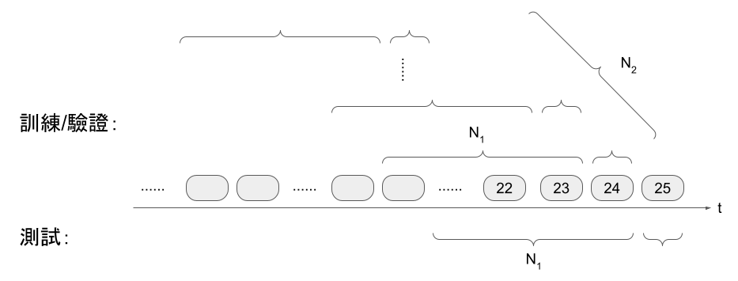

# 2021-credit-card-consuming-recommendation

My implementation and sharing of this contest: https://tbrain.trendmicro.com.tw/Competitions/Details/18. I got rank 9 in the Private Leaderboard.

## Run My Implementation

### Required libs

matplotlib, numpy, pytorch, and yaml. Versions of them are not restricted as long as they're new enough.

### Preprocess
```bash
python3 data_to_pkl.py
```
* The officially provided csv file should be in `data` dir.
* Output pkl file is also in `data` dir.

### Feature Extraction
```bash
python3 pkl_to_fea_allow_shorter.py
```
* See "作法分享" for detailed description of optional parameters.

### Training
```bash
python3 train_cv_allow_shorter.py -s save_model_dir
```
* `-s`: where you want to save the trained model.

### Inference

#### Generate model outputs
```bash
python3 test_cv_raw_allow_shorter.py model_dir max_len
```
* `model_dir`: directory of the trained model.
* `max_len`: max number of months considered for each customer.

#### Merge model outputs
```bash
python3 test_cv_merge_allow_shorter.py n_fold_train
```
* `n_fold_train`: number of folds used for training.

## 作法分享

以下將介紹本競賽的問題概述，以及所使用的執行環境、特徵截取、模型設計與訓練，以及預測方式。

### 問題概述

* 給定資料：兩年期間內，五十萬名信用卡持卡人，每人每月消費了 49 類商品當中的哪幾種的相關記錄，以及其基本資料。
* 預測目標：下個月對其中 16 類商品的購買金額的前三名。
* 評估標準： NDCG。

### 執行環境

硬體方面，初始時使用 ASUS P2440 UF 筆電，含 i7-8550U CPU 及 MX130 顯示卡，主記憶體擴充至 20 GB；後續使用較多特徵及較長期間的資料時，改為使用 AWS p2.xlarge 機器，含 K80 顯示卡以及約 64 GB 主記憶體。AWS 的經費來源是[上一個比賽](https://tbrain.trendmicro.com.tw/Competitions/Details/15)進入複賽拿到的點數，在打完複賽後還有剩下來的部分。

程式語言為 Python 3，未特別指定版本；函式庫則如本說明前半部所示，其中的 matplotlib 為繪圖觀察用，而 yaml 為儲存模型組態用。

### 特徵截取(附帶資料觀察)與預測目標

官方給出的資料格式，是每人在兩年期間內的每月，若對 49 種類別任何之一有消費或退貨記錄，則就會有一個 row 來記錄他，包含消費了多少錢、用了哪張卡，乃至於這個人的基本資料，例如年齡區間或婚姻狀態等等狀況。因此關於特徵抽取的一個最直覺的想法，就是把每人每類的消費記錄排起來當特徵，有缺的再補零，但是從官方給出的資料量就可以評估出，這會消費掉非常大的儲存和運算資源。如果只取有消費的部分，對每類別都做出固定維度的特徵再合併，則可能會因為每人每月的維度數量不一（沿特徵維度合併時），或者無法確知其時間關係（沿時間維度合併時）而難以訓練模型。另外，對於年齡區間或婚姻狀態這類可能不太會變化的資訊，如果不必讓它在每個時間都被精確記錄的話，也可以省下儲存和運算資源。

因此，我只截取一部分較為高額的消費記錄來組成特徵。我先將欄位分為兩類，依照「訓練資料欄位說明」的順序，從 shop_tag（消費類別）起至 card_other_txn_amt_pct （其他卡片消費金額佔比）止，因為是從每月每類的消費行為而來，且消費行為必然是變動的，因此列為「時間變化類」；而 masts （婚姻狀態）起至最後為止，因實際所觀察到的每人的婚姻狀態或教育程度等，在比賽資料所截取的兩年間確實幾乎都不會變化，故列為「時間不變類」，以節省運算及儲存資源。兩種類別詳細的取值方式如下。

#### 時間變化類

對於每人每月的消費紀錄，以如下步驟取特徵，若某人某月未有消費紀錄則忽略之，不施予補零或其他任何措施：
1. 排序出消費金額前 n 大者，最佳成績中使用的 n 為 13。根據觀察，約 99% 的人，其每月消費類別數在 13 以下。
2. 取該月時間特徵，為待預測月減去該月，共 1 維。
3. 該月類別特徵共 49 維，若該月該類別消費金額在該月前 n 名中且金額大於 0 者，其特徵值由名次大到小依次為 n, n-1, n-2, …, 1；前 n 名以外或金額小於等於 0 的類別，其特徵值為 0。
4. 對於前 n 名的每個類別，無論其消費金額皆取以下特徵，共 22 維：txn\_cnt, txn\_amt (取 log), domestic\_offline\_cnt, domestic\_online\_cnt, overseas\_offline\_cnt, overseas\_online\_cnt, domestic\_offline\_amt\_pct, domestic\_online\_amt\_pct, overseas\_offline\_amt\_pct, overseas\_online\_amt\_pct, card\_\*\_txn\_cnt (* = 1, 2, 4, 6, 10, other), card\_\*\_txn\_amt\_pct (\* = 1, 2, 4, 6, 10, other)。
   * 1, 2, 4, 6, 10, other 為所有消費紀錄中，使用次數最多的前六個卡片編號。
5. 以上共 1 + 49 + 13 \* 22 = 336 維

跨月份的取值方式如下圖所示，其中每個圓角方塊代表每人的一個月份的所有消費紀錄，而在最佳結果中，N<sub>1</sub> 設為 20 個月，N<sub>2</sub> 設為 4 組；我試過不同大小的 N<sub>1</sub>，例如 5、10、15、23 等，但效果都比 20 略差，很可能代表某些類別的購買行為，需要夠長的區間才能看出來。另外，N<sub>1</sub> 代表的是一個上限，在有消費月份數達 N<sub>1</sub> 或以上時，會進行下圖所示的分組；而消費月份數短於 N<sub>1</sub> 時，亦會將資料保留，並將模型設計成能在一個 batch 內，接受長度不同的資料。



#### 時間不變類

對於每位客戶，僅使用取特徵值範圍內最後消費當月（N<sub>1</sub> 範圍內的最後一筆）的金額最大的類別所記載的資料來組成特徵。

使用時，以 masts, gender_code, age, primary_card, slam 各自編成 one-hot encoding 或數值型態後組合，共得 20 維，細節說明如下
* masts: 含缺值共 4 種狀態，4 維。
* gender\_code: 含缺值共 3 種狀態，3 維。
* age: 含缺值共 10 種狀態，10 維。
* primary\_card: 沒有缺值，共 2 種狀態，2 維。
* slam: 數值型態，取 log 後做為特徵，1 維。

此部分亦嘗試過加入其他欄位，但可能是因為組成特徵的維度較大不易訓練（如 cuorg，含缺值共 35 維），或客戶有可能填寫不實（如 poscd），故未取得較好之結果。我亦嘗試過加入範圍內最初消費當月（N<sub>1</sub> 範圍內的第一筆），來一起做為 BiLSTM 的 initial states，但也未取得較好之結果。

#### 預測目標

共 16 維，代表需要預測的 16 個類別，其中下月金額第一名者為 1，第二名者 0.8，第三名者 0.6，第四名以下有購買者 0.2，未購買者 0。

#### 其他說明

* 在「時間不變類」的欄位當中，平均每人用過的不同狀態，平均約為 1.005 至 1.167 種，最多的則為 3 至 5 種。
* txn\_amt 和 slam 是經過官方神秘轉換後的結果，其值非常大，但是我發現取了 log 看起來會正常一些，所以我在組成特徵時才會把它們取 log。
* N<sub>1</sub> 為 `pkl_to_fea_allow_shorter.py` 中的 `-len`，N<sub>2</sub> 為 `pkl_to_fea_allow_shorter.py` 中的 `-max`。
* 以上取法經去除輸出全部為 0，即預測目標月份沒有購買行為之資料後，共約 102 萬組，而每種長度的資料組數則沒有另做觀察。

### 模型設計與訓練

本次比賽使用的模型架構如下圖，主體為 BiLSTM + attention，前後加上適量的 linear layers，其中標色部分為 attention 的做用範圍，最後面的 dense layers 之細部架構則為 (dense 128 + ReLU + dropout 0.1) * 2 + dense 16 + Sigmoid。模型實作時，參考了[這篇文章](https://meetonfriday.com/posts/4d6a906a/)，來讓模型在訓練階段時，可以接受一個 batch 內有不同長度的資料。


訓練方式為 5 folds cross validation，細節參數如下，未提及之參數係依照 pytorch 預設值，未進行修改：
* Num of epochs: 100 epochs，若 validation loss 連續 10 個 epochs 未創新低，則提前終止該 fold 的訓練。
* Batch size: 512。
* Loss: MSE。
* Optimizer: ADAM with learning rate 0.01。
* Learning rate scheduler: 每個 epoch 下降為上一次的 0.95 倍，直至其低於 0.0001 為止。

由此產生出的 5 個模型，都會做為預測使用。

### 預測

預測時會將五個模型的結果取平均，再依據平均後的排名輸出前三名的類別。需要注意的是，預測時使用的 N<sub>1</sub> 可以跟特徵抽取時的不同，例如我發現若訓練時的 N<sub>1</sub> 取 5、10，或 15，則預測時用大一點的 N<sub>1</sub>，亦即看多一點的資料的效果可能會較好。
